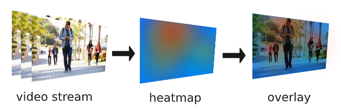
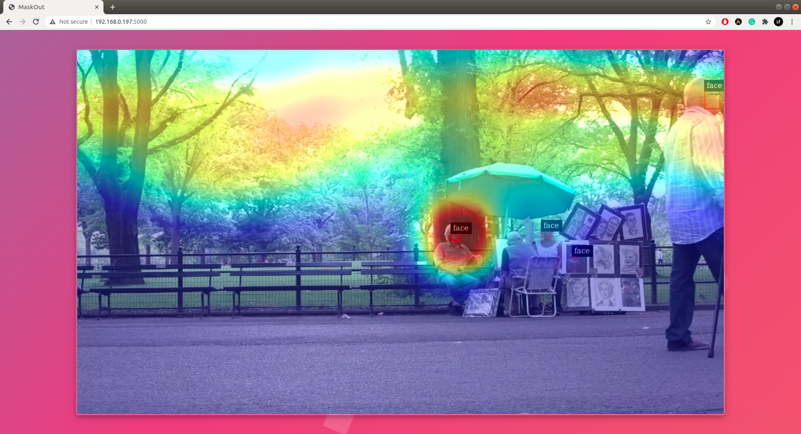

# Maskout
A Jetson based DeepStream application to identify areas of high risk through intuitive heat maps.
[Read Medium blog](https://medium.com/@Smartcow_ai/605335f63d50).

## Workflow
- If a face without mask is detected then the region will be painted on the screen.
- If more and more faces without mask cross through the same region the area will be painted with more intense colors.
- If nobody has crossed for a very long time the color intensity will start fading out.



>In other words, a Heat Map will be generated continuously representing regions where faces have been detected recently. Allowing us to see through the time.

The application is containerized and uses DeepStream as the backbone to run TensorRT optimized models for the maximum throughput. Built on top of [deepstream-imagedata-multistream](https://github.com/NVIDIA-AI-IOT/deepstream_python_apps/tree/master/apps/deepstream-imagedata-multistream) sample app.

## Steps to run
- I have used Jetson Nano Devkit (2GB), you can set up on any other Jetson device.
- Make sure `nvidia-docker` is installed on the device (it comes pre-installed with JetPack 4.3+).
- clone the maskout repository.
    ````
    $ git clone https://github.com/imneonizer/maskout.git
    $ cd maskout
    ````
- Build the docker container.
    ````
    $ sudo docker build . -t maskout
    ````
- Run the docker container.
    ````
    export DISPLAY=:1
    xhost +
    sudo docker run --rm -it --gpus all \
        -v /home/$USER/videos:/videos \
        -e DISPLAY=$DISPLAY -v /tmp/.X11-unix/:/tmp/.X11-unix --net host \
        --name maskout-ds-container --hostname maskout \
        maskout bash
    ````
- Once inside the container, you can run the DeepStream application using:
    - `
    python3 maskout_app.py file:///videos/1.mp4` or
    - `python3 maskout_app.py rtsp://<user>:<pass>@<camera-ip>`.
- To view the Heatmap, open another terminal and execute below command.
    ````
    sudo docker exec -it maskout-ds-container bash run_ui.sh
    ````
    This will keep on fetching frames from the DeepStream container and serving to port `5000`.
    You can keep this application running and restart the DeepStream application with different input streams. visit http://localhost:5000 to view heatmap.
    
- Under high load, the RAM consumption went up to 1.2 GB + 600 MB used by Linux Kernel.

## Notes
- The application is containarized and requires 2.6 Gb of disk space.
- While flashing Jetson Nano using SDK manager, unselect `DeepStream` as we are going to use containers, it will save you 800 Mb of space.
- After flashing only few MB's are left on the SD card even though your SD card has more storage, this can be reclaimed by going to `Disks` setting then extending the unallocated space with root.
- If you run out of `RAM` while building or running the container, on Jetson Nano (2Gb) you can:
    - remove `GTK` and run Jetson on headless mode.
    - add `swap-memory` to get more ram.
- This application only supports single stream processing.
- UI can be run sepearately on another machine, it requires two ports for the communication one for rtsp stream and another for heatmap. using this method you can do some of the processing on client side.
- If you don't care about drawing bounding boxes, the inference can be boosted and more FPS can be achieved by setting `enable_osd = False` in first line of the `main()` inside `maskout_app.py`
